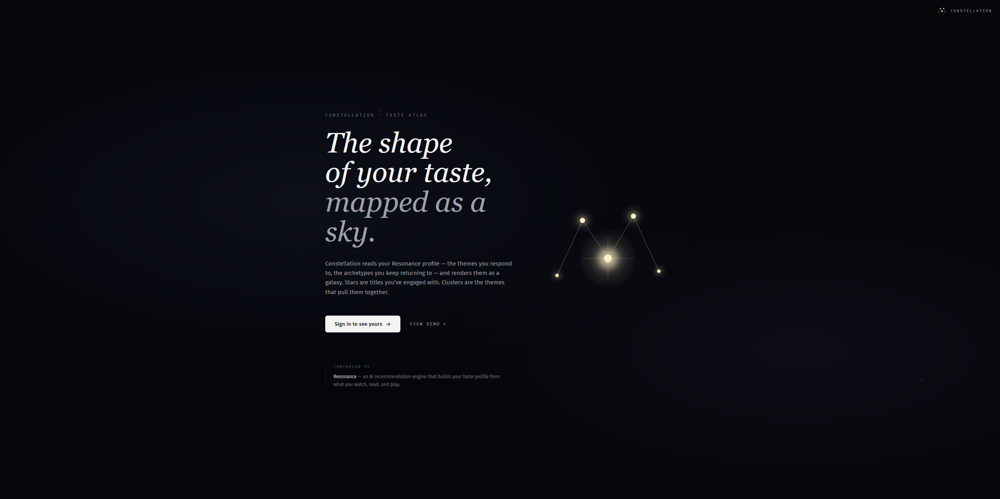
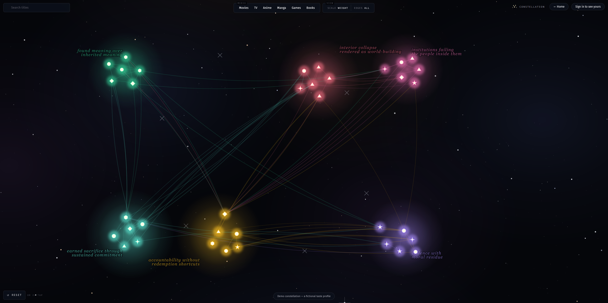
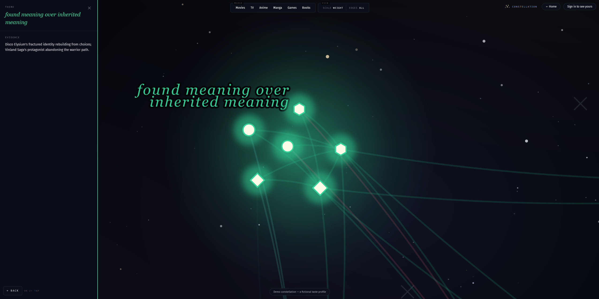

# Constellation

> An interactive force-directed map of your media taste — themes as nebula clusters, titles as stars, connections drawn between works that share thematic ground.

**Live demo: [constellation-alpha-eight.vercel.app](https://constellation-alpha-eight.vercel.app)**

A frontend-craft companion to [Resonance](https://github.com/Drubnerw98/Resonance), an AI recommendation engine that builds the structured taste profile this visualization renders. Both apps share a single Clerk OAuth instance; Constellation reads `/api/profile/export` from Resonance with a bearer token and transforms the response (a `TasteProfile` + library items + recommendations + favorites + avoidances) through a graph-builder pipeline before feeding it into a D3 force simulation rendered as SVG.

For the architectural deep-dive — the *why* behind every major decision — see **[ARCHITECTURE.md](./ARCHITECTURE.md)**.







## Features

- **Force-directed cluster placement** — themes are bodies in an auxiliary D3 simulation, charge scales with theme weight, collide enforces minimum spacing. Initial positions seeded from a hash of theme labels so the layout is reproducible per profile across reloads.
- **Three-tier fuzzy tag matching** — AI-generated `tasteTags` rarely match canonical theme labels verbatim. Three fallback tiers (exact match → substring with min-length floor → content-token overlap with bidirectional within-token substring) reconcile drift like `"sacrifice"` against `"earned sacrifice through sustained commitment"`.
- **Load-balanced primary-theme assignment** — naive "highest-weight wins" left lower-weight themes as empty clusters. Greedy load-balanced assignment with weight-ascending tiebreak ensures every cluster gets at least one resident.
- **Per-format glyph language** — circle (movie), triangle (TV), hexagon (anime), diamond (game), 5-point star (manga), 4-point sparkle (book). All shapes equal visual area so differentiation reads as identity, not size.
- **Cluster-level "why" surface** — galaxy-mode panel surfaces the AI's per-theme `evidence` text (the 100-200 word paragraph explaining why this theme exists in your profile). Per-item rationale was deliberately removed — it was inconsistently populated, which read as broken.
- **Anti-stars** — disliked titles render as muted X marks around the canvas perimeter, in the negative space outside the cluster orbits. Visualizes "what's outside your taste" alongside the constellation.
- **Connection visibility toggle** — default mode shows only the selected node's edges (clean canvas). Toggle to see the full edge mesh.
- **Cluster scale toggle** — radius driven by either `theme.weight` (default) or member count.
- **Bottom-sheet mobile panels** — DetailPanel and ClusterPanel slide up from the bottom on phones, slide in from the side on desktop. Same component, breakpoint-driven transform.
- **Pre-focus zoom restore** — entering galaxy mode snapshots the user's current pinch/pan state; exiting restores it instead of jumping to identity. Switching between clusters preserves the original snapshot (one back-stack item, no ping-pong).
- **Touch-aware hit areas** — 30px viewBox-unit invisible hit circles around every node so finger taps register reliably once the SVG scales to a phone viewport.
- **Editorial typography vocabulary** — Fira Sans for chrome, Fira Code for mono captions/numerics, Iowan Old Style serif italic for in-canvas cluster labels (star-chart aesthetic). Semantic CSS color tokens, no zinc-500 utility chains.
- **Sample fallback** — signed-out / no-profile / API-error states all fall back to a curated sample profile (`/demo` route exposes it directly). Banner explains why on the fallback paths.
- **Drift-on-rest** — `alphaTarget(0.03)` keeps the simulation gently ticking forever so nodes orbit slowly within their clusters. Disabled when `prefers-reduced-motion`.

## Stack

| Layer       | Choice                                                 |
| ----------- | ------------------------------------------------------ |
| Framework   | React 19 + TypeScript 5.9, Vite 6                      |
| Layout      | D3 v7 — `forceSimulation`, drag, zoom                  |
| Styling     | Tailwind v4 (`@theme` directive), Fira Sans + Code     |
| Routing     | react-router-dom 7                                     |
| Auth        | Clerk (OAuth shared with [Resonance](https://github.com/Drubnerw98/Resonance)) |
| Tests       | Vitest + happy-dom (graph builder unit tests)          |
| Lint/format | ESLint flat config + Prettier + Tailwind class sorting |
| CI          | GitHub Actions (`typecheck` → `lint` → `test` → `build`) |
| Deploy      | Vercel (frontend-only; Resonance is the backend dependency) |

## Layout

```
constellation/
├── src/
│   ├── main.tsx              # ClerkProvider + BrowserRouter mount
│   ├── App.tsx               # Routes: / (Landing|Home), /demo, * → /
│   ├── routes/
│   │   ├── Landing.tsx       # signed-out hero with editorial typography
│   │   ├── Home.tsx          # signed-in: real-data hook + sample fallback
│   │   └── Demo.tsx          # /demo: always sample data
│   ├── components/
│   │   ├── ConstellationView.tsx          # orchestrator — owns view state
│   │   ├── SiteMark.tsx                   # asterism + wordmark, shared
│   │   ├── constellation/
│   │   │   ├── ConstellationCanvas.tsx    # D3 simulation + SVG layers (large)
│   │   │   ├── ClusterPanel.tsx           # left slide-in (galaxy mode)
│   │   │   └── DetailPanel.tsx            # right slide-in (selected node)
│   │   └── controls/
│   │       ├── FilterBar.tsx              # format + view toggles
│   │       └── SearchInput.tsx            # title search with pan-to-node
│   ├── lib/
│   │   ├── api.ts            # Resonance API client (Bearer token, status mapping)
│   │   ├── graph.ts          # buildGraph + force-directed cluster placement
│   │   ├── graph.test.ts     # vitest unit tests (matching, dedupe, edges, clusters)
│   │   └── colors.ts         # cluster color palette
│   ├── hooks/
│   │   └── useResonanceProfile.ts # discriminated-union status hook
│   ├── data/
│   │   └── sampleProfile.ts  # curated fallback / demo source
│   └── types/                # GraphNode, ProfileExport, Avoidance, etc.
├── public/favicon.svg        # SVG asterism (matches in-app SiteMark glyph)
├── ARCHITECTURE.md           # subsystem-by-subsystem reasoning
├── eslint.config.js
├── vercel.json               # SPA fallback rewrite
└── .github/workflows/check.yml
```

## Setup

```sh
pnpm install
cp .env.local.example .env.local   # if it exists; else create one
```

Two environment variables are required to run:

```sh
VITE_CLERK_PUBLISHABLE_KEY=pk_test_...      # same value Resonance uses
VITE_RESONANCE_API_URL=https://...           # Resonance API base URL
```

Both are public (`VITE_*` are inlined at build). The Clerk key has to match the publishable key on the Resonance instance you're pointing at — they share OAuth identities. The Resonance URL is the API server (e.g. the Render-hosted Express service), not the Resonance frontend.

To run against a local Resonance backend, point `VITE_RESONANCE_API_URL` at `http://localhost:3001` and add `http://localhost:5174` to that backend's `FRONTEND_ORIGIN` env var so its CORS middleware accepts the call.

## Dev

```sh
pnpm dev                # Vite on :5174
pnpm typecheck          # tsc --noEmit
pnpm lint               # eslint
pnpm test               # vitest run
pnpm check              # all three above
pnpm format:write       # apply Prettier
```

## Deployment

Constellation deploys as a static SPA on **Vercel**. Backend dependency (Resonance) lives separately on Render.

### Frontend — Vercel

1. **Import the repo** at [vercel.com/new](https://vercel.com/new). Vercel auto-detects Vite.
2. **Environment variables** (Settings → Environment Variables, scoped Production + Preview + Development):
   - `VITE_CLERK_PUBLISHABLE_KEY` → same publishable key Resonance uses
   - `VITE_RESONANCE_API_URL` → Resonance API base URL (no trailing slash, no whitespace)
3. **Deploy.** `vercel.json` ships an SPA rewrite so `/demo` and any future routes resolve to `index.html` on direct hit.

### Backend dependency — Resonance CORS

Constellation hits the Resonance API from the browser, so Resonance has to allow the prod origin. Append `https://<your-vercel-url>.vercel.app` to Resonance's `FRONTEND_ORIGIN` env var (comma-separated). Without this, signed-in users see "Resonance is unreachable" on the constellation.

### Gotchas

- **`VITE_*` env vars are baked in at build.** Setting them after a deploy doesn't retroactively apply — you have to redeploy. Trailing whitespace in the env value is also baked in literally; verify the saved value.
- **No backend of its own.** Constellation can't fall back to mock data on a Resonance outage transparently — it shows the sample with an amber banner explaining why. Acceptable for portfolio scope; would need a server-side cache for real production.

## Status

**Shipped + deployed:**

- Live at [constellation-alpha-eight.vercel.app](https://constellation-alpha-eight.vercel.app)
- Real OAuth via Clerk, real bearer-token data fetch from Resonance
- Force-directed cluster layout with three-tier fuzzy tag matching + load-balanced primary assignment
- Per-format glyph language across 6 media types
- Editorial typography system (Fira Sans/Code + Iowan serif italic for canvas labels)
- Bottom-sheet mobile panels, touch-tuned hit areas, mobile-aware filter layout
- Cluster info panel in galaxy mode with AI-generated theme evidence
- Anti-stars (dislikedTitles) on the canvas perimeter
- Connection visibility toggle + cluster scale toggle (FilterBar)
- Pre-focus zoom snapshot/restore (galaxy mode entry/exit)
- Sample fallback for signed-out / no-profile / error states (`/demo` route exposes it as a stable URL)
- GitHub Actions CI: `typecheck → lint → test → build` on every push + PR

**Deferred (intentional):**

- Pattern avoidances (the abstract `kind: "pattern"` ones) — would need a different surface; they don't have titles to attach to
- Public read-only sharing (URL with a snapshot of someone else's constellation)
- Keyboard navigation (Tab through nodes, Esc to close panels, arrow keys to pan)
- Server-side caching of Resonance responses (would let it survive a backend outage)

See **[ARCHITECTURE.md → Open design questions](./ARCHITECTURE.md#9-open-design-questions)** for layout/design decisions deliberately left open.

## How this was built

Constellation is the second project in a paired build — [Resonance](https://github.com/Drubnerw98/Resonance) shipped first as the AI recommendation system; Constellation shipped after as the visualization layer.

Both projects were built with Claude (the LLM) as a pair-programmer in Claude Code. The implementation work — generating the D3 force tuning, refactoring the React components, writing the type-safe transforms, debugging mobile touch hit-areas — was done in conversation. Design judgment, copy decisions, when to push back on a suggestion, when to discard a pass and try a different direction, what visual quality bar to hold the result to: that was me.

The result is a real codebase I can defend in interviews (every architectural choice has a reason I can explain), not a one-shot generated project. The commit history is granular and honest about that work — search for the small "fix"-style commits where I caught Claude doing something wrong, or for the visual-audit threads where I rejected a pass and asked for a redesign.

## License

Portfolio project; not currently licensed for redistribution.
